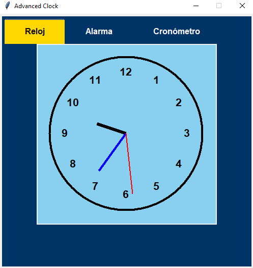
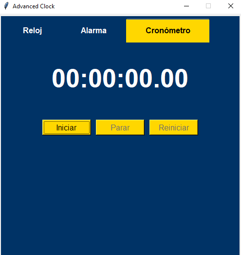
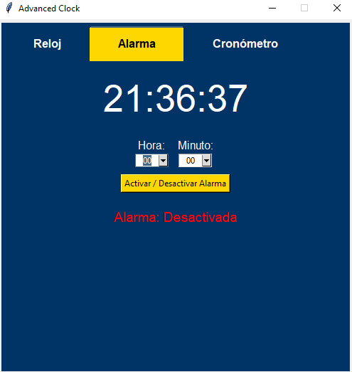

# Mini_proyecto
Proyecto tkinter, modelo de reloj digital

# mini_proyecto
Proyecto tkinter, modelo de reloj digital

# 🕒 TKinder Reloj



**TKinder Reloj** es una aplicación de escritorio en Python con Tkinter que ofrece reloj digital en tiempo real, cronómetro con registro de laps y un sistema de alarmas configurable.

## 📋 Tabla de Contenidos

- [Características](#características)
- [Capturas de Pantalla][def]
- [Requisitos](#requisitos)
- [Instalación](#instalación)
- [Uso](#uso)
- [Estructura del Código](#estructura-del-código)
- [Autores](#autores)
- [Licencia](#licencia)

---

## ✨ Características

- 🕓 Reloj digital en tiempo real.
- ⏱️ Cronómetro con lista de mediciones (laps).
- ⏰ Despertador con alarmas activables/desactivables.
- 💡 Interfaz moderna y modular basada en POO.
- 📦 Proyecto limpio, escalable y con separación de responsabilidades.

---

## 📸 Capturas de Pantalla

### Reloj Digital




---

## ⚙️ Requisitos

- Python 3.10 o superior
- Tkinter (incluido por defecto)
- pytz (`pip install pytz`)

---

## 💻 Instalación

```bash
git clone https://github.com/Yesica5310/Mini_proyecto.git
cd Reloj Funcional
pip install -r requirements.txt
python main.py

🧩 Estructura del código
main.py: Punto de entrada principal
# 🕒 TKinder Reloj


**TKinder Reloj** es una aplicación de escritorio en Python con Tkinter que ofrece reloj digital en tiempo real, cronómetro con registro de laps y un sistema de alarmas configurable. Desarrollado con enfoque modular, ideal para aprendizaje, práctica profesional o como base para proyectos mayores.

---

## 📋 Tabla de Contenidos

* [Características](#características)
* [Capturas de Pantalla](#capturas-de-pantalla)
* [Requisitos](#requisitos)
* [Instalación](#instalación)
* [Uso](#uso)
* [Uso de Módulos](#uso-de-módulos)
* [Estructura del Código](#estructura-del-código)
* [To-Do / Mejoras Futuras](#to-do--mejoras-futuras)
* [Autores](#autores)
* [Licencia](#licencia)

---

## ✨ Características

* 🕓 Reloj digital en tiempo real.
* ⏱️ Cronómetro con lista de mediciones (laps).
* ⏰ Despertador con alarmas activables/desactivables.
* 💡 Interfaz moderna y modular basada en POO.
* 🧩 Separación clara de responsabilidades.
* 🧪 Pruebas funcionales en diversos entornos.

---

## 📸 Capturas de Pantalla

### Reloj Digital


### Cronómetro


### Despertador


---

## ⚙️ Requisitos

* Python 3.10 o superior
* Tkinter (incluido por defecto en Python)

```bash
pip install pytz
```

---

## 💻 Instalación

```bash
git clone https://github.com/Yesica5310/Mini_proyecto.git
cd Reloj Funcional
pip install -r requirements.txt
python main.py
```

---

## ▶️ Uso

* **Ejecutar la app:** `python main.py`
* Cambiar entre pestañas de reloj, cronómetro y despertador.
* Usar botones en cronómetro para iniciar, pausar y registrar laps.
* En el despertador, seleccionar hora y guardar; se puede activar/desactivar.

---

## 🔌 Uso de Módulos

Puedes importar componentes individuales para integrarlos en otros proyectos:

```python
from cronometro import Cronometro
cron = Cronometro(root)

from despertador import Despertador
alarm = Despertador(root, get_time_func)
```

---

## 🧩 Estructura del Código

```
tkinder-reloj/
│
├── main.py             # Punto de entrada principal
├── interfaz.py         # GUI principal, organiza pestañas
├── cronometro.py       # Lógica y vista del cronómetro
├── despertador.py      # Manejo de alarmas
├── assets/             # Capturas de pantalla y recursos visuales
├── requirements.txt    # Dependencias
└── README.md           # Documentación
```

---

## 🔮 To-Do / Mejoras Futuras

* [ ] Exportar laps del cronómetro a CSV
* [ ] Soporte para múltiples alarmas simultáneas
* [ ] Sonidos personalizables para alarmas
* [ ] Modo oscuro / claro configurable
* [ ] Ejecutable multiplataforma (.exe)

---

## 👥 Autores

**Proyecto desarrollado por el equipo TechKinder:**

* 🎨 **Interfaz**: Todos
* 🕒 **Reloj Digital**: Paola Yesica Lezcano, Sheila Sanchez
* ⏰ **Despertador**: Nicolas Tomadin
* ⏱️ **Cronómetro**: Daniel Acevedo
* 🧪 **Pruebas**: Paola Yesica Lezcano, Marcelo Ojeda
* 📄 **Documentación**: Paola Yesica Lezcano
* 📋 **Organización**: Marcelo Ojeda
* 🧰 **Soporte y portabilidad**: Marcelo Ojeda, Paola Yesica Lezcano

---

## 📝 Licencia 

Este proyecto está bajo la Licencia MIT. Puedes usarlo, modificarlo y distribuirlo libremente con atribución.

(C) 2025 TechKinder Dev Team

[def]: #capturas-de-pantalla